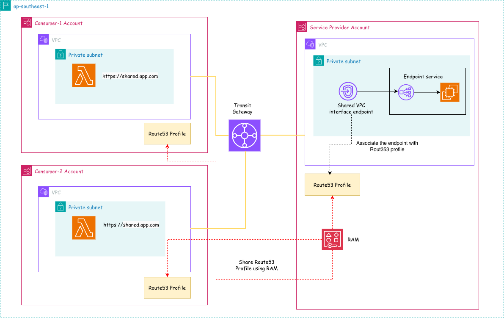

# Centralized VPC Interface Endpoints Using AWS Route 53 Profiles

This Terraform project implements a centralized VPC interface endpoint architecture using AWS Route53 profiles across multiple AWS accounts, enabling secure DNS resolution for shared services through VPC endpoints.
## Architecture Overview



The solution consists of:

- **Service Provider Account**: Hosts the shared VPC interface endpoint and Route53 profile
- **Consumer Accounts**: Multiple accounts that consume the shared DNS service via Route53 profiles
- **Transit Gateway**: Provides connectivity between accounts
- **RAM (Resource Access Manager)**: Shares Route53 profiles across accounts

## Key Components

### Service Provider Account
- **VPC with Private Subnet**: Contains the shared VPC interface endpoint
- **VPC Interface Endpoint**: Provides access to AWS services (e.g., Lambda)
- **Route53 Profile**: Centralized DNS configuration shared via RAM
- **Endpoint Service**: Exposes the shared service endpoint

### Consumer Accounts
- **VPC with Private Subnet**: Consumer workloads and applications
- **Route53 Profile Association**: Links to the shared Route53 profile
- **Lambda Functions**: Example workloads accessing shared services via `https://shared.app.com`

### Connectivity
- **Transit Gateway**: Enables cross-account VPC connectivity
- **RAM Sharing**: Distributes Route53 profiles to consumer accounts
- **DNS Resolution**: Centralized DNS routing through shared profiles

## Benefits

- **Centralized DNS Management**: Single point of DNS configuration
- **Cost Optimization**: Shared VPC endpoints reduce per-account costs
- **Security**: Private connectivity without internet exposure
- **Scalability**: Easy addition of new consumer accounts
- **Compliance**: Centralized control over DNS resolution

## File Structure

```
├── consumer-account-ram.tf          # RAM associations for consumer accounts
├── consumer-account-test.tf         # Test resources in consumer accounts
├── consumer-account-vpc.tf          # Consumer account VPC configuration
├── data.tf                         # Data sources
├── lambda/                         # Lambda function code
│   └── index.mjs                   # Test Lambda function
├── locals.tf                       # Local values
├── providers.tf                    # AWS provider configuration
├── service-provider-account-app.tf # Application resources
├── service-provider-account-ram.tf # RAM sharing configuration
├── service-provider-account-route53.tf # Route53 profiles and DNS
├── service-provider-account-test.tf # Test resources
├── service-provider-account-tgw.tf # Transit Gateway configuration
├── service-provider-account-vpc.tf # Service provider VPC
└── versions.tf                     # Terraform version constraints
```

## Prerequisites

- AWS CLI configured with appropriate permissions
- Terraform >= 1.0
- Access to multiple AWS accounts (service provider and consumer accounts)
- Permissions for:
  - VPC and subnet management
  - Route53 profile creation and sharing
  - RAM resource sharing
  - Transit Gateway operations
  - Lambda function deployment

## Deployment

1. **Configure Variables**: Update the Terraform variables for your environment
2. **Initialize Terraform**:
   ```bash
   terraform init
   ```
3. **Plan Deployment**:
   ```bash
   terraform plan
   ```
4. **Apply Configuration**:
   ```bash
   terraform apply
   ```

## Testing

The project includes test Lambda functions that demonstrate DNS resolution through the shared Route53 profiles. These functions attempt to resolve `https://shared.app.com` to verify the centralized DNS configuration.

## Cleanup

To destroy the infrastructure:
```bash
terraform destroy
```

## Security Considerations

- All communication flows through private subnets
- VPC endpoints eliminate internet gateway dependencies
- Route53 profiles provide controlled DNS resolution
- RAM sharing maintains account isolation while enabling resource sharing